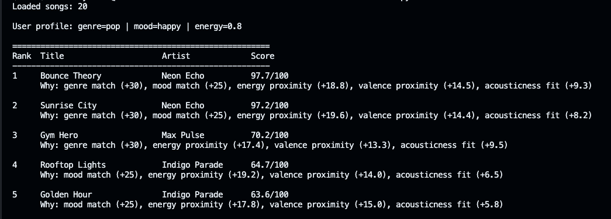

# 🎵 Music Recommender Simulation

## Project Summary

In this project you will build and explain a small music recommender system.

Your goal is to:

- Represent songs and a user "taste profile" as data
- Design a scoring rule that turns that data into recommendations
- Evaluate what your system gets right and wrong
- Reflect on how this mirrors real world AI recommenders

Summary of Finished Version Goals:
...

---

## How The System Works

Real-world recommenders like Spotify or YouTube learn from massive amounts of behavioral data — what millions of users skip, replay, or share — and combine that with audio features to predict what you'll want next. Our version skips the behavioral data entirely and works purely from content: it compares the properties of each song directly against a user's stated preferences. This makes the logic transparent and easy to reason about, at the cost of personalization depth. The system prioritizes **listening intent** (genre and mood first, then energy level) over fine-grained audio texture, because those two signals most reliably predict whether a song fits a moment.

### Song Features

Each `Song` object stores:

- `genre` — broad category of sound (e.g. lofi, rock, jazz, ambient)
- `mood` — emotional tone (e.g. chill, intense, happy, focused)
- `energy` — float 0.0–1.0, how driving or passive the track feels
- `valence` — float 0.0–1.0, musical positivity (high = upbeat, low = somber)
- `danceability` — float 0.0–1.0, rhythmic suitability for movement
- `acousticness` — float 0.0–1.0, how organic vs. produced the sound is
- `tempo_bpm` — beats per minute

### UserProfile Features

Each `UserProfile` stores:

- `favorite_genre` — the genre the user most wants to hear
- `favorite_mood` — the mood the user is in or wants to match
- `target_energy` — float 0.0–1.0, how energetic the user wants the music
- `likes_acoustic` — boolean, whether the user prefers acoustic over electronic sounds

### Scoring and Ranking

The `Recommender` scores each song individually using a weighted formula: genre and mood matches award fixed points, while numeric features (energy, acousticness) are scored by proximity — how close the song's value is to the user's target, not simply whether it's high or low. Scores are normalized to [0, 1]. The ranking rule then sorts all songs by score descending and returns the top `k` results.

### Algorithm Recipe

For every song in the catalog, compute a score out of 100 using the following steps:

1. **Genre match** — if `song.genre == user.favorite_genre`, award **+30 pts**
2. **Mood match** — if `song.mood == user.favorite_mood`, award **+25 pts**
3. **Energy proximity** — award up to **+20 pts** using `20 * (1 - abs(song.energy - user.target_energy))`
4. **Valence proximity** — award up to **+15 pts** using `15 * (1 - abs(song.valence - implied_valence))`, where implied valence is derived from the user's mood selection
5. **Acousticness match** — if `user.likes_acoustic` is `True`, award up to **+10 pts** proportional to `song.acousticness`; if `False`, award up to **+10 pts** proportional to `1 - song.acousticness`

After all songs are scored, sort descending by total score and return the top `k`.

### Potential Biases

- **Genre over-dominance:** With 30 pts locked behind a genre match, two songs that perfectly match a user's mood and energy but differ in genre will always rank below a genre-match with mediocre other scores. Great cross-genre discoveries (e.g., a jazz track that perfectly fits a "focused" study session) may get buried.
- **Mood label rigidity:** Moods are discrete labels. A song tagged `relaxed` and one tagged `chill` may feel nearly identical to a listener, but this system treats them as completely different — penalizing the `relaxed` song for a user who said `chill`.
- **Acousticness binary:** `likes_acoustic` is a boolean, which flattens a spectrum into two camps. Users who enjoy a mix of acoustic and produced sounds won't be well-served.
- **Small catalog amplifies noise:** With only 20 songs, a single scoring decision (like the genre weight) can dominate the entire ranking. Results may feel "locked in" rather than nuanced.

### CLI Output



---

## Getting Started

### Setup

1. Create a virtual environment (optional but recommended):

   ```bash
   python -m venv .venv
   source .venv/bin/activate      # Mac or Linux
   .venv\Scripts\activate         # Windows

2. Install dependencies

```bash
pip install -r requirements.txt
```

3. Run the app:

```bash
python -m src.main
```

### Running Tests

Run the starter tests with:

```bash
pytest
```

You can add more tests in `tests/test_recommender.py`.

---

## Experiments You Tried

Use this section to document the experiments you ran. For example:

- What happened when you changed the weight on genre from 2.0 to 0.5
- What happened when you added tempo or valence to the score
- How did your system behave for different types of users

---

## Limitations and Risks

Summarize some limitations of your recommender.

Examples:

- It only works on a tiny catalog
- It does not understand lyrics or language
- It might over favor one genre or mood

You will go deeper on this in your model card.

---

## Reflection

Read and complete `model_card.md`:

[**Model Card**](model_card.md)

Write 1 to 2 paragraphs here about what you learned:

- about how recommenders turn data into predictions
- about where bias or unfairness could show up in systems like this


---

## 7. `model_card_template.md`

Combines reflection and model card framing from the Module 3 guidance. :contentReference[oaicite:2]{index=2}  

```markdown
# 🎧 Model Card - Music Recommender Simulation

## 1. Model Name

Give your recommender a name, for example:

> VibeFinder 1.0

---

## 2. Intended Use

- What is this system trying to do
- Who is it for

Example:

> This model suggests 3 to 5 songs from a small catalog based on a user's preferred genre, mood, and energy level. It is for classroom exploration only, not for real users.

---

## 3. How It Works (Short Explanation)

Describe your scoring logic in plain language.

- What features of each song does it consider
- What information about the user does it use
- How does it turn those into a number

Try to avoid code in this section, treat it like an explanation to a non programmer.

---

## 4. Data

Describe your dataset.

- How many songs are in `data/songs.csv`
- Did you add or remove any songs
- What kinds of genres or moods are represented
- Whose taste does this data mostly reflect

---

## 5. Strengths

Where does your recommender work well

You can think about:
- Situations where the top results "felt right"
- Particular user profiles it served well
- Simplicity or transparency benefits

---

## 6. Limitations and Bias

Where does your recommender struggle

Some prompts:
- Does it ignore some genres or moods
- Does it treat all users as if they have the same taste shape
- Is it biased toward high energy or one genre by default
- How could this be unfair if used in a real product

---

## 7. Evaluation

How did you check your system

Examples:
- You tried multiple user profiles and wrote down whether the results matched your expectations
- You compared your simulation to what a real app like Spotify or YouTube tends to recommend
- You wrote tests for your scoring logic

You do not need a numeric metric, but if you used one, explain what it measures.

---

## 8. Future Work

If you had more time, how would you improve this recommender

Examples:

- Add support for multiple users and "group vibe" recommendations
- Balance diversity of songs instead of always picking the closest match
- Use more features, like tempo ranges or lyric themes

---

## 9. Personal Reflection

A few sentences about what you learned:

- What surprised you about how your system behaved
- How did building this change how you think about real music recommenders
- Where do you think human judgment still matters, even if the model seems "smart"

